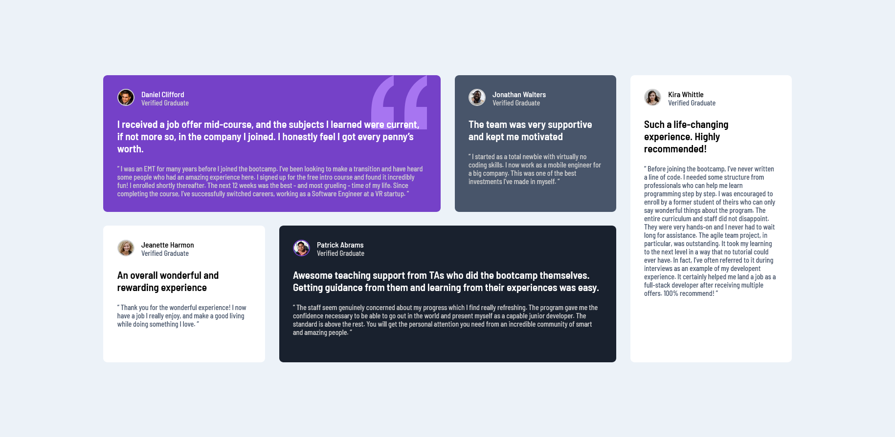

<!-- LINKS -->

## Links

- Solution URL: [Frontend Mentor Solution](https://www.frontendmentor.io/solutions/testimonials-section-responsive-grid-sass-bem-flexbox-bTHAW_3zAT)
- Live Site URL: [Live site](https://abestian.github.io/testimonials-FM/)

<!-- ABOUT THE PROJECT -->

## About The Project

The objective of this project was to create a responsive testimonials section using grid.

<!-- BUILT WITH -->

## Built With

- Semantic HTML5 markup
- CSS custom properties
- Flexbox
- Grid
- Mobile-first workflow
- SASS pre-processor
- [BEM methodology](https://getbem.com/)

<!-- ROADMAP -->

## Roadmap

- [x] Create the section styling for mobile devices
- [x] Create the section styling for desktop devices
- [x] Ensure responsibility and required positioning across different screen sizes

<!-- AUTHOR -->

## Author

Frontend Mentor - [@Abestian](https://www.frontendmentor.io/profile/Abestian)
